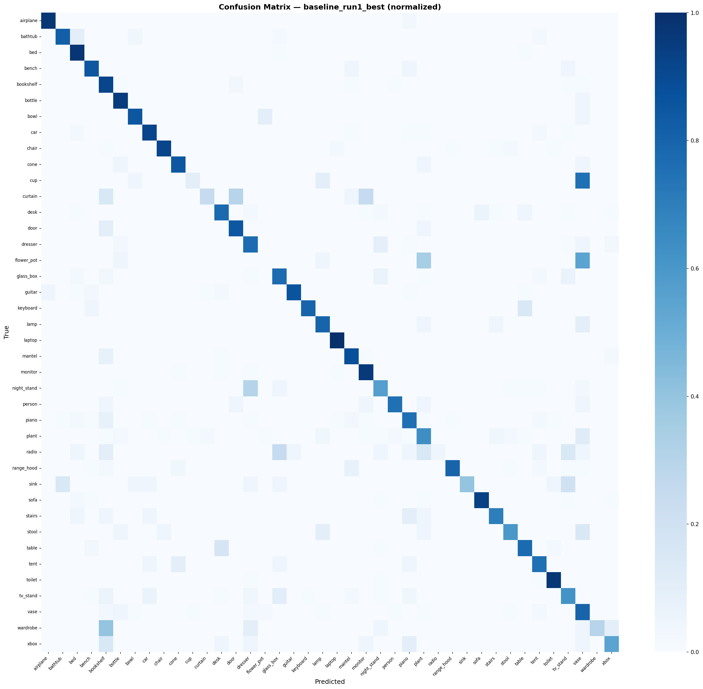
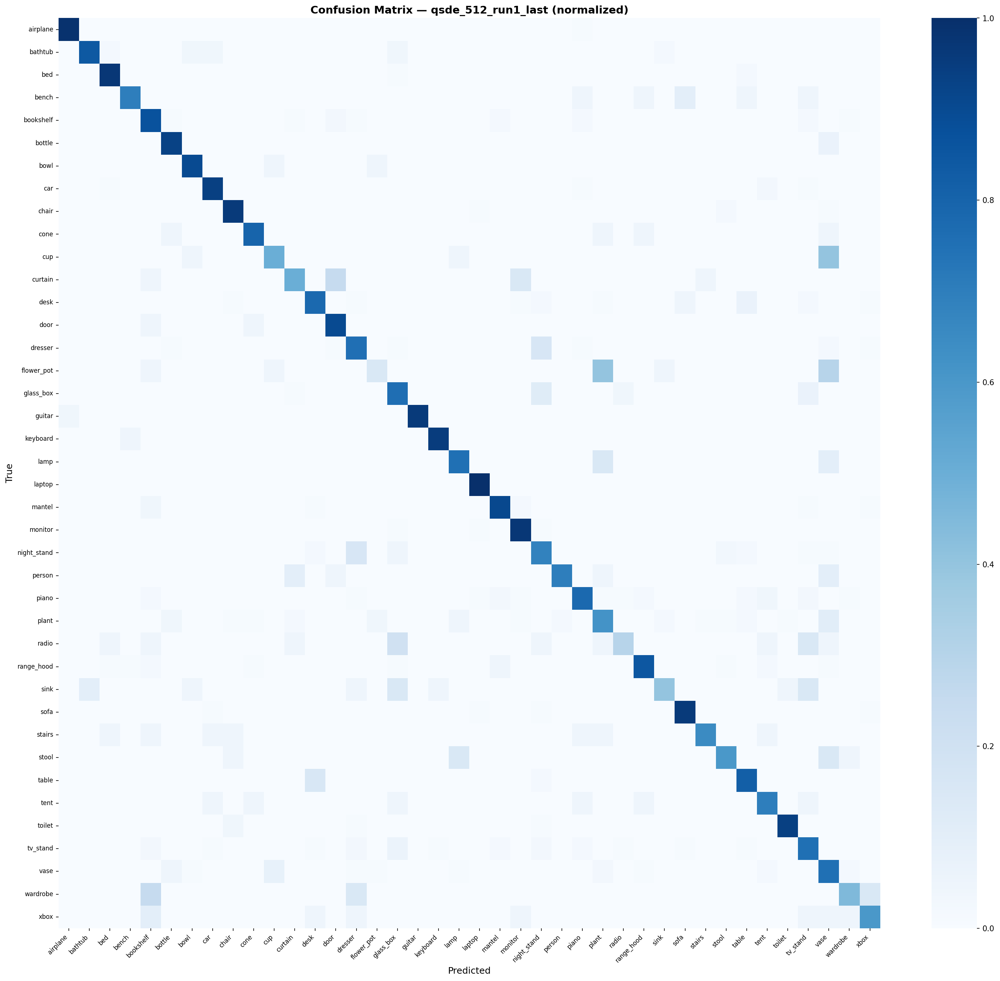

# Spiking PointNet + Q-SDE

> Independent re-implementation of **Spiking PointNet** (NeurIPS 2023) extended with **Queue-Driven Sampling Direct Encoding (Q-SDE)** from Spiking Point Transformer (AAAI 2025) for ModelNet40 3D point cloud classification.

---

## Results

| Model | Encoding | Train T | Infer T | ModelNet40 OA (%) | mAcc (%) |
|-------|----------|---------|---------|-------------------|----------|
| ANN PointNet (reference) | n/a | n/a | n/a | 89.2 | 86.0 |
| Spiking PointNet (paper) | Direct | 1 | 4 | 88.61 | n/a |
| **Ours: Baseline\*** | Direct | 1 | 4 | **79.94** | **71.99** |
| **Ours: + Q-SDE-512\*** | Q-SDE | 4 | 4 | **82.54** | **75.85** |

\* Independent re-implementation based on the paper description, not cloned from the official repository. The ~8-9% gap vs the paper is expected given implementation differences and hyperparameter sensitivity in SNN training. Q-SDE encoding improves OA by **+2.6%** and mAcc by **+3.86%** over the baseline.

### Confusion Matrices

**Baseline (Direct Encoding) -- 79.94% OA**



**Q-SDE-512 -- 82.54% OA**



---

## What This Project Does

### Background: Spiking Neural Networks for Point Clouds

Standard deep learning uses floating-point multiply-accumulate (MAC) operations at every neuron, expensive in both compute and energy. **Spiking Neural Networks (SNNs)** replace continuous activations with binary spikes (0 or 1). When a neuron spikes, downstream neurons perform only an **addition** (AC), not a multiply-add. This makes SNNs theoretically 5-8x more energy-efficient than equivalent ANNs on neuromorphic hardware.

**Spiking PointNet** (NeurIPS 2023) applies this idea to 3D point cloud understanding. It takes the classic PointNet architecture for ModelNet40 classification and replaces every ReLU activation with a **Leaky Integrate-and-Fire (LIF)** spiking neuron. The LIF neuron accumulates input into a membrane potential over time, firing a spike when the potential crosses a threshold, then resetting.

### The Trained-Less Paradigm

A key insight from the paper: train with **T=1 timestep** but evaluate with **T=4 timesteps**. Because LIF neurons carry membrane state across timesteps, running inference for more steps gives the network more time to process the input, effectively improving accuracy without any retraining. This is unique to SNNs and has no ANN equivalent.

### Q-SDE: Smarter Temporal Encoding

The baseline approach feeds the same point cloud to the network T times (direct encoding), redundant by design. **Q-SDE (Queue-Driven Sampling Direct Encoding)**, borrowed from the Spiking Point Transformer (AAAI 2025), creates T *diverse* subsets instead:

- **Timestep 0**: Sample Ns points from the full cloud using Farthest Point Sampling (FPS)
- **Timestep i**: Drop the oldest Np points from the previous window, sample Np fresh points from the unsampled remainder via FPS, slide the window forward

This gives each timestep a different geometric view of the object, reducing temporal redundancy and acting as spatial data augmentation across time without changing any model weights.

### This Project

We re-implement Spiking PointNet from scratch in PyTorch + SpikingJelly based on the paper description, then swap in Q-SDE encoding to measure the accuracy improvement. Everything -- the LIF neuron, T-Net spatial transformers, shared MLP blocks, FPS sampling, FIFO queue logic, training loop with AMP and gradient accumulation -- is implemented from scratch.

Notable implementation findings during development:

- **Max-pooling saturates binary spikes**: With ~30% per-point firing rate over 1024 points, max-pool collapses to all-1s across all channels, eliminating spatial variance. Mean-pooling (firing rate) was used throughout instead.
- **T-Net zero-init bug**: Zero-initialized final FC layer in T-Net produced identity transforms with zero STN loss. Fixed with small normal initialization (std=1e-3).
- **Temporal accumulation**: Classifier LIF neurons step sequentially across T timesteps, accumulating membrane potential. The T dimension is genuine time, not a batch axis.

---

## Project Structure

```
spiking-pointnet-qsde/
├── configs/
│   ├── baseline.yaml           # Direct encoding, T=1 train / T=4 infer, 200 epochs
│   └── qsde.yaml               # Q-SDE encoding, Ns=512, T=4 train and infer
│
├── src/spk_pointnet/
│   ├── models/
│   │   ├── lif_neuron.py       # LIF neuron wrapping SpikingJelly, sigmoid surrogate gradient
│   │   ├── pointnet_utils.py   # SharedMLP (Linear+BN+LIF), TNet, STN regularization loss
│   │   └── spiking_pointnet.py # Full model: T-Net -> MLP -> T-Net -> MLP -> pool -> classifier
│   ├── encoding/
│   │   ├── direct_encoding.py  # Baseline: repeat point cloud T times -> [B, T, N, 3]
│   │   └── qsde.py             # Q-SDE: FIFO queue FPS -> [B, T, Ns, 3]
│   ├── data/
│   │   └── modelnet40.py       # Dataset loader, normalization, augmentation, DataLoader
│   ├── training/
│   │   ├── trainer.py          # Training loop: AMP, grad accumulation, tqdm, CSV logging
│   │   └── losses.py           # Cross-entropy + label smoothing + T-Net regularization
│   └── utils/
│       ├── metrics.py          # Overall Accuracy (OA), Mean Class Accuracy (mAcc)
│       ├── synops.py           # Hook-based SynOps counter
│       └── visualize.py        # Training curves, confusion matrix, model comparison plots
│
├── scripts/
│   ├── train.py                # Main training entry point
│   ├── evaluate.py             # Evaluate checkpoint: OA, mAcc, SynOps, confusion matrix
│   └── download_data.py        # ModelNet40 download (may timeout, see Dataset section)
│
├── notebooks/
│   └── results_analysis.ipynb  # Training curves, OA bar chart, comparison table
│
├── results/                    # Confusion matrix PNGs and training CSVs
├── data/                       # Dataset (not tracked by git)
└── checkpoints/                # Model checkpoints (not tracked by git)
```

---

## Requirements

- Python 3.10
- PyTorch 2.2.0 + CUDA
- SpikingJelly 0.0.0.0.14
- GPU with at least **8 GB VRAM** (tested on RTX 4060 Ti 8 GB)
- ~3 GB disk space for dataset + checkpoints

---

## Setup

### 1. Clone the repository

```bash
git clone https://github.com/Samwise-Potato-Gamgee/spiking-pointnet-qsde.git
cd spiking-pointnet-qsde
```

### 2. Create and activate a conda environment

```bash
conda create -p ./env python=3.10 -y
conda activate ./env
```

### 3. Install dependencies

```bash
pip install -r requirements.txt
pip install -e .
```

---

## Dataset: ModelNet40

ModelNet40 contains 12,311 CAD models across 40 object categories (chair, airplane, lamp, etc.), split into 9,843 training and 2,468 test samples. Each model is pre-processed into 2,048 points stored in HDF5 format.

### Download

The automated download script may time out due to Stanford server reliability issues. **Manual download is recommended:**

1. Download the file (~440 MB) from one of these sources:
   - **Kaggle**: search [`modelnet40_ply_hdf5_2048`](https://www.kaggle.com/datasets/search?q=modelnet40_ply_hdf5_2048)
   - **Tsinghua Cloud**: `https://cloud.tsinghua.edu.cn/f/b3d9fe3e2a514def8097/?dl=1`
   - **GitHub**: search "modelnet40_ply_hdf5_2048.zip" in PointNet/PointNet++ issues

2. Place the zip in the `data/` folder and extract:

```bash
mkdir -p data
# Copy modelnet40_ply_hdf5_2048.zip into data/
cd data && unzip modelnet40_ply_hdf5_2048.zip && cd ..
```

3. Verify the structure:

```
data/
└── modelnet40_ply_hdf5_2048/
    ├── ply_data_train0.h5 ... ply_data_train4.h5
    ├── ply_data_test0.h5, ply_data_test1.h5
    ├── train_files.txt
    ├── test_files.txt
    └── shape_names.txt
```

> **Note**: The `.h5` files must be inside `data/modelnet40_ply_hdf5_2048/` and not directly in `data/`. The `train_files.txt` expects this exact path.

---

## Training

### Baseline -- Spiking PointNet (direct encoding)

```bash
python scripts/train.py \
    --config configs/baseline.yaml \
    --run_name baseline_run1 \
    --seed 42 \
    --gpu 0
```

Expected: ~90 seconds/epoch on RTX 4060 Ti, ~5 hours total for 200 epochs.

### Q-SDE variant (Ns=512, T=4)

```bash
python scripts/train.py \
    --config configs/qsde.yaml \
    --run_name qsde_512_run1 \
    --seed 42 \
    --gpu 0
```

### Low VRAM / OOM recovery

```bash
python scripts/train.py \
    --config configs/qsde.yaml \
    --batch_size 8 \
    --grad_accum 2 \
    --run_name qsde_512_accum2 \
    --gpu 0
```

### Resume from checkpoint

```bash
python scripts/train.py \
    --config configs/baseline.yaml \
    --resume checkpoints/baseline_run1_last.pth \
    --run_name baseline_run1
```

### All CLI options

| Flag | Default | Description |
|------|---------|-------------|
| `--config` | required | Path to YAML config file |
| `--run_name` | `run` | Name for checkpoint and CSV files |
| `--seed` | `42` | Random seed for reproducibility |
| `--gpu` | `0` | GPU index |
| `--batch_size` | from config | Override config batch size |
| `--epochs` | from config | Override number of epochs |
| `--no_amp` | False | Disable mixed precision (for debugging) |
| `--grad_accum` | `1` | Gradient accumulation steps |
| `--resume` | None | Path to checkpoint to resume from |
| `--use_wandb` | False | Enable Weights & Biases logging |

Metrics are saved to `results/metrics_<run_name>.csv` after each epoch.
Best checkpoint saved to `checkpoints/<run_name>_best.pth`.

---

## Evaluation

```bash
python scripts/evaluate.py \
    --checkpoint checkpoints/baseline_run1_best.pth

python scripts/evaluate.py \
    --checkpoint checkpoints/qsde_512_run1_best.pth \
    --T_infer 4
```

Outputs OA, mAcc, per-class accuracy breakdown, and confusion matrix saved to `results/`.

---

## Comparing Results

```bash
jupyter notebook notebooks/results_analysis.ipynb
```

Or from Python:

```python
from spk_pointnet.utils.visualize import compare_models

compare_models(
    csv_paths=[
        'results/metrics_baseline_run1.csv',
        'results/metrics_qsde_512_run1.csv',
    ],
    model_names=['Baseline (Direct)', 'Q-SDE-512'],
    save_dir='results/',
)
```

---

## Key Implementation Details

**LIF neuron**: SpikingJelly's `LIFNode` with sigmoid surrogate gradient (k=4). Hard reset after each spike. Paper's decay factor tau=0.25 is converted to SpikingJelly's time constant via `tau_sj = 1 / (1 - 0.25) = 4/3`.

**T-Net**: Spatial transformer using SharedMLP + LIF neurons throughout. Mean-pooling over points -- max-pooling saturates binary spikes to all-1s over 1024 points, eliminating channel variance. Orthogonality regularization: `L_reg = ||I - A*A^T||^2_F * 0.001`.

**Q-SDE**: Implemented from scratch without `torch_cluster`. Manual FPS in pure PyTorch. FIFO queue via boolean mask over original N points. Batched over batch dimension via loop.

**Temporal accumulation**: Classifier LIF neurons (`lif1`, `lif2`) step sequentially across T timesteps -- T is genuine time, not a batch axis. Feature extraction MLPs flatten T into the batch dimension (each timestep processed independently via shared weights).

**Training**: AMP (mixed precision) enabled by default, required to fit T=4 within 8 GB VRAM. `functional.reset_net()` called at the start of every forward pass to clear LIF membrane states between samples.

---

## References

1. **Spiking PointNet** -- Zhang et al., NeurIPS 2023
   https://arxiv.org/abs/2310.06232

2. **Spiking Point Transformer (SPT)** -- AAAI 2025
   Q-SDE encoding (Algorithm 1) borrowed from this work.
   SPT reports ModelNet40 OA = 91.43% with full transformer + HD-IF + Q-SDE.

3. **PointNet** -- Qi et al., CVPR 2017
   https://arxiv.org/abs/1612.00593

4. **SpikingJelly** -- Fang et al.
   https://github.com/fangwei123456/spikingjelly